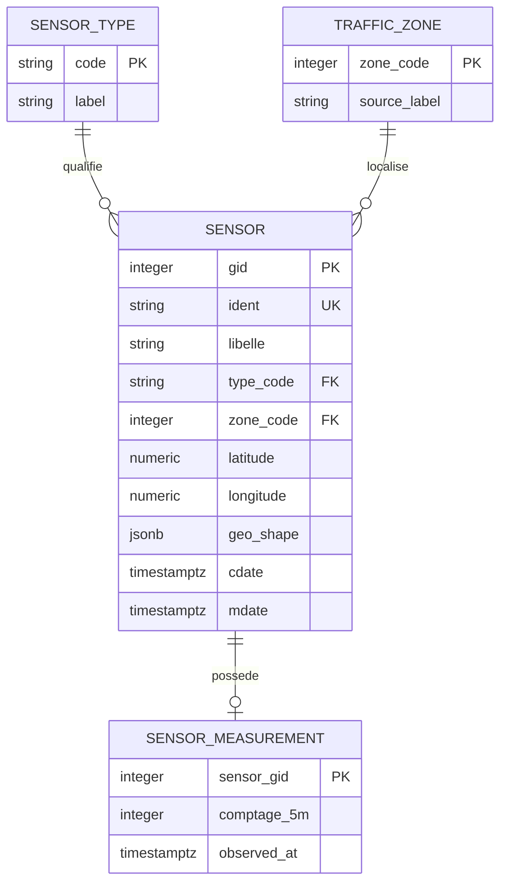
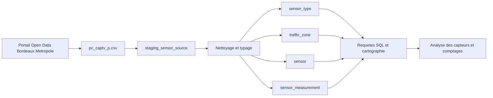

# TP - Audit et cartographie des donnees

## 1. Sujet, contexte et objectif

**Sujet choisi : transport et mobilite cyclable a Bordeaux Metropole.**

Bordeaux Metropole exploite des points de comptage afin de localiser les sites de suivi des flux cyclistes. Le fichier etudie permet de repondre a la question suivante : **ou sont situes les capteurs, de quel type sont-ils et quelles informations de comptage sont disponibles dans l'extrait fourni ?**

L'objectif est de passer d'un fichier CSV reel a une description fiable de la source, un dictionnaire de donnees, un modele conceptuel et logique normalise, une implementation PostgreSQL et une cartographie du flux.

## 2. Sources de donnees

| Source | Organisation / origine | URL | Format | Nature | Description |
|---|---|---|---|---|---|
| `pc_captv_p.csv` fourni dans le dossier | Bordeaux Metropole, Direction des Transports et de la Mobilite Durable | [Portail Open Data](https://opendata.bordeaux-metropole.fr/explore/dataset/pc_captv_p/) | CSV delimite par `;`, avec champ GeoJSON | Structuree, avec une colonne semi-structuree (`Geo Shape`) | Inventaire geolocalise des capteurs de trafic velo : capteurs ponctuels, boucles et 4G. |
| Fiche de reference du jeu `pc_captv_p` | Bordeaux Metropole / PIGMA | [Dictionnaire public](https://data.bordeaux-metropole.fr/dicopub/#/dico#pc_captv_p) | Page web / metadonnees | Semi-structuree | Precise l'objectif, les types de capteurs, la frequence de mise a jour et les limites d'interpretation. |

La fiche officielle indique que les capteurs automatiques peuvent produire des comptages a un pas de 5 minutes, tandis que les capteurs 4G sont disponibles a J+1 au pas horaire. Le CSV fourni est un extrait d'inventaire : il ne contient pas l'historique des mesures.

### Qualite et perimetre observes

- 419 lignes et 10 colonnes.
- 419 valeurs `ident` uniques.
- Types : 329 `PONCTUEL`, 33 `BOUCLE`, 57 `4G`.
- `Geo Shape` est present pour les 419 lignes.
- `comptage_5m` est renseigne pour 31 lignes et vide pour 388 lignes.
- `zone = 0` pour 329 lignes ; les autres lignes sont rattachees a des codes de zones.
- `cdate` commence le 28/04/2021 dans l'extrait ; `mdate` va jusqu'au 24/09/2026.

## 3. Dictionnaire de donnees

| Champ source | Description | Type source | Type PostgreSQL propose | Exemple |
|---|---|---|---|---|
| `Geo Point` | Coordonnees du point sous forme `latitude, longitude` | Texte structure | `text` conserve + `numeric` pour latitude/longitude | `44.8362039, -0.578552` |
| `Geo Shape` | Representation GeoJSON du point | JSON | `jsonb` | `{"coordinates":[-0.578552,44.8362039],"type":"Point"}` |
| `gid` | Identifiant technique du capteur dans la source | Entier | `integer`, PK | `2616` |
| `libelle` | Adresse ou description du site et direction | Texte | `text` | `18 rue Marechal Joffre - Vers Place Pey Berland` |
| `ident` | Identifiant fonctionnel du point de comptage | Texte | `varchar(30)`, UNIQUE | `P52.2` |
| `type` | Technologie ou nature du site de comptage | Texte | FK vers `sensor_type.code` | `PONCTUEL` |
| `zone` | Code de zone de rattachement ; `0` est conserve comme valeur source | Entier sous forme texte | FK vers `traffic_zone.zone_code` | `0` |
| `comptage_5m` | Valeur de comptage sur 5 minutes lorsqu'elle est disponible | Texte numerique nullable | `integer` nullable, `CHECK >= 0` | vide ou `12` |
| `cdate` | Date de creation de l'enregistrement dans la source | Date ISO avec fuseau | `timestamptz` | `2021-04-28T12:57:13+02:00` |
| `mdate` | Date de derniere modification de l'enregistrement | Date ISO avec fuseau | `timestamptz` | `2026-09-24T10:15:00+02:00` |

**Transformation geographique :** `Geo Point` est conserve pour la tracabilite, tandis que sa premiere coordonnee est chargee dans `latitude` et sa seconde dans `longitude`. `Geo Shape` reste disponible en `jsonb` pour ne pas perdre la representation originale. Le script verifie les bornes geographiques.

## 4. Entites, attributs, relations et cardinalites

- **SENSOR_TYPE** : referentiel des trois modalites de `type`.
- **TRAFFIC_ZONE** : referentiel des codes de `zone` presents dans le fichier.
- **SENSOR** : point de comptage geolocalise, identifie par `gid` et `ident`.
- **SENSOR_MEASUREMENT** : mesure courante issue de `comptage_5m`, nullable car la source ne fournit pas toujours une valeur.

Relations :

- `SENSOR_TYPE 1 ---- N SENSOR` : chaque capteur a un type ; un type peut concerner plusieurs capteurs.
- `TRAFFIC_ZONE 1 ---- N SENSOR` : chaque capteur est rattache a un code de zone source ; une zone peut contenir plusieurs capteurs.
- `SENSOR 1 ---- 0..1 SENSOR_MEASUREMENT` : le CSV fournit au plus une valeur courante par capteur et cette valeur peut manquer.

La separation des referentiels evite de repeter les libelles de type et permet de controler les valeurs par des cles etrangeres. `gid` est la cle primaire technique de la source ; `ident` est une cle candidate fonctionnelle rendue unique.

## 5. Modele conceptuel

## 6. Modele logique

- `sensor_type(code PK, label)`
- `traffic_zone(zone_code PK, source_label)`
- `sensor(gid PK, ident UK, libelle, type_code FK, zone_code FK, latitude, longitude, geo_point_source, geo_shape, cdate, mdate)`
- `sensor_measurement(sensor_gid PK/FK, comptage_5m, observed_at)`

Les champs geographiques sont indexes pour les recherches simples ou une migration ulterieure vers PostGIS. `observed_at = mdate` dans le chargement est une date de reference de l'extrait, pas necessairement la date exacte de la mesure.

## 7. Implementation PostgreSQL

Le script [postgresql_schema.sql](postgresql_schema.sql) cree les tables, charge le CSV dans une table de staging, transforme les textes, alimente les tables normalisees, insere deux mesures de test et propose des requetes de verification. Depuis `psql`, se placer dans le dossier du projet avant execution et adapter au besoin le chemin de `\copy`.

## 8. Cartographie globale

**Flux et limites :** origine Bordeaux Metropole ; entree CSV ; transformation des identifiants, dates, comptages et coordonnees ; stockage PostgreSQL avec staging ; sortie sous forme de requetes et inventaire geolocalise. L'extrait local ne contient pas l'historique des mesures : une analyse temporelle necessite le jeu historique horaire ou les webservices officiels.
