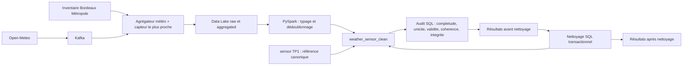

# Cartographie qualité TP3

## Schéma source/cible et contrôles

## Tables et champs contrôlés

La table TP3 auditée est `weather_sensor_clean`, créée par
`database/sql/tp2_schema.sql`. Ses champs comprennent :

- identité/temps : `event_id`, `observed_at`, `collected_at`, `processed_at` ;
- météo : `source`, `temperature_c`, `humidity_pct`, `wind_speed_kmh`,
  `precipitation_mm` ;
- référence/enrichissement capteur : `sensor_gid`, `sensor_ident`,
  `sensor_type`, `zone`, `sensor_latitude`, `sensor_longitude`,
  `sensor_label`, `comptage_5m`.

La jointure de contrôle est `weather_sensor_clean.sensor_gid` vers
`sensor.gid`. Les identifiants métier, type, zone, coordonnées et libellé
doivent correspondre aux valeurs canoniques du TP1.

## Fichiers d'audit et de correction

- `database/sql/tp3_audit.sql` produit les nombres d'anomalies par contrôle ;
- `database/sql/tp3_clean.sql` applique les substitutions documentées ;
- `scripts/setup_tp3.py` lance audit avant → nettoyage → audit après et écrit
  les résultats dans `reports/tp3/`.

Les contrôles sur les contraintes (PK, FK, `NOT NULL`, `CHECK`) sont
conservés en audit défensif : les violations ne devraient pas pouvoir exister
dans la table cible.
