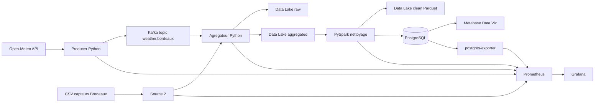

# TP2 - Pipeline temps reel et plateforme DataSuite

## Sujet et choix des sources

Le projet conserve le sujet du TP1 : l'analyse de la mobilite cyclable a Bordeaux Metropole.

- **Source 1 - API continue : Open-Meteo**. L'API fournit toutes les 30 secondes la temperature, l'humidite, le vent et les precipitations pour Bordeaux. Elle est publique et ne demande pas de cle.
- **Source 2 - CSV Bordeaux Metropole**. `data/pc_captv_p.csv` decrit les 419 capteurs cyclables avec leur position, leur type, leur zone et un comptage 5 minutes eventuel.

La relation metier est l'enrichissement : chaque observation meteo est rattachee au capteur de l'inventaire le plus proche. Le flux permet donc de comparer les conditions meteorologiques et les informations disponibles sur les points de comptage.

## Architecture



Services Docker : Kafka, Zookeeper, producer, source2, aggregator, Spark/PySpark, PostgreSQL, Metabase, Prometheus, Grafana et postgres-exporter. Les volumes nommes `kafka_data`, `postgres_data`, `datalake_data`, `prometheus_data`, `grafana_data`, `metabase_data` et `zookeeper_data` assurent la persistance.

## Pipeline

1. `producer.py` interroge Open-Meteo, ajoute un `event_id` UUID et publie l'evenement dans Kafka.
2. `source2.py` copie periodiquement le CSV vers `data-lake/raw/source2`.
3. `aggregator.py` consomme Kafka, conserve l'evenement brut dans `raw/api` et produit `aggregated/weather_sensors.jsonl` apres rattachement au capteur le plus proche.
4. `spark_job.py` lit l'agrege, controle les types, supprime les doublons par `event_id`, remplace les precipitations absentes par zero, supprime les lignes sans identifiant obligatoire et ecrit Parquet dans `clean`.
5. Spark charge `weather_sensor_clean` dans PostgreSQL avec `ON CONFLICT DO NOTHING`, ce qui rend les relances idempotentes.

## Demarrage

Prerequis : Docker Desktop demarre et Docker Compose v2.

```powershell
docker compose up -d --build
docker compose ps
```

Le script historique est aussi disponible :

```powershell
python .\scripts\setup_project.py
```

Le premier demarrage peut prendre quelques minutes pour construire les images et initialiser PostgreSQL. Les donnees sont generees ensuite automatiquement toutes les 30 secondes.

## Exploitation

- **Metabase** : http://localhost:3001. Ajouter la base PostgreSQL `transport_velo`, hote `postgres`, port `5432`, utilisateur `audit_user`, mot de passe `audit_password`.
- **Grafana** : http://localhost:3000, identifiants `admin` / `admin`. Le dashboard `DataSuite - Pipeline TP2` est provisionne automatiquement.
- **Prometheus** : http://localhost:9090.
- **PostgreSQL** : port local `5433`.

Requetes de controle :

```powershell
docker compose exec postgres psql -U audit_user -d transport_velo -c "SELECT COUNT(*) AS clean_records FROM weather_sensor_clean;"
docker compose exec postgres psql -U audit_user -d transport_velo -c "SELECT event_id, observed_at, sensor_ident, temperature_c, comptage_5m FROM weather_sensor_clean ORDER BY observed_at DESC LIMIT 5;"
```

L'indicateur Raw vs Clean est disponible dans Grafana via `datalake_raw_records` et `postgres_clean_records`. Les compteurs agreges sont exposes par `metrics.py` sur le port 9105 et collectes par Prometheus.

## Arborescence TP2

```text
pipeline/                 producteurs, source 2, agregateur, metriques
spark/                    Dockerfile et job PySpark
data-lake/                point de montage du Data Lake
monitoring/               configuration Prometheus et dashboard Grafana
database/sql/tp2_schema.sql table PostgreSQL propre
docker-compose.yml        orchestration complete
```

## Limites connues

Le CSV du TP1 est un inventaire de capteurs et non un historique de mesures. Le rattachement meteo/capteur est donc un enrichissement spatial de demonstration. Pour une analyse de correlation robuste, il faudrait ajouter l'API historique des comptages velo ou une source de mesures horodonnees.
